# Migrate Custom Monitor

# Table of Contents

- [Migrate Custom Monitor](#migrate-custom-monitor)
- [Table of Contents](#table-of-contents)
- [Overview](#overview)
- [Environment \& Pre-requisites](#environment--pre-requisites)
  - [Blueprint Setup _(for F5 employees or customers with access to UDF)_](#blueprint-setup-for-f5-employees-or-customers-with-access-to-udf)
    - [1. Deploy Blueprint](#1-deploy-blueprint)
    - [2. Setup SSH Keys](#2-setup-ssh-keys)
    - [3. Enter Blueprint](#3-enter-blueprint)
    - [4. Clone Repository](#4-clone-repository)
  - [Docker Setup](#docker-setup)
    - [1. Data Initialization for Docker](#1-data-initialization-for-docker)
    - [2. Build Docker](#2-build-docker)
    - [3. Add SSH Private Keys](#3-add-ssh-private-keys)
  - [Environment Setup](#environment-setup)
    - [1. Application Initialization](#1-application-initialization)
    - [2. TMOS Initialization](#2-tmos-initialization)
    - [3. Creating Objects in TMOS](#3-creating-objects-in-tmos)
- [Manual Workflow Guide](#manual-workflow-guide)
  - [1. Get BIG-IP UCS Archive](#1-get-big-ip-ucs-archive)
  - [2. Migrate the App](#2-migrate-the-app)
    - [2.1 Upload UCS Archive into Central Manager](#21-upload-ucs-archive-into-central-manager)
    - [2.2 Migrate as Draft](#22-migrate-as-draft)
    - [2.3 Verify Migrated Monitor](#23-verify-migrated-monitor)
- [Automated Workflow Guide](#automated-workflow-guide)
  - [1. Run Migration](#1-run-migration)
  - [2. Verify Migrated Monitor](#2-verify-migrated-monitor)

# Overview

This guide showcases the migration of a custom monitor from TMOS to BIG-IP Next using BIG-IP Next Central Manager.

The first part of this guide will focus on manual migration of monitor, while the second part focuses on the automation flow.

# Environment & Pre-requisites

You may use your own environment with BIG-IP TMOS and BIG-IP Next, in which, as a pre-requisite, you need to have at a minimum:

- BIG-IP TMOS

- BIG-IP Next Central Manager.

For executing automation scripts, you need to utilize a Linux machine with network access to the BIG-IP instances: BIG-IP TMOS, BIG-IP CM. On this Linux machine you may choose to run Docker in order to take advantage of the sample app(s) and tooling (Ansible, Terraform, etc.)

Before starting monitor migration we will need to set up our environment. Environment configuration will include the following steps:

- Docker setup (optional)
- Application initialization
- TMOS initialization
- Creating necessary objects in TMOS

## Blueprint Setup _(for F5 employees or customers with access to UDF)_

**If you are an F5 employee or customer with access to UDF, you can use the following BIG-IP Next blueprint flow as the foundation for your environment: "NEXT WAF-Automation (20.3.0)". Search for this name and utilize the latest version of the blueprint. This GitHub repo is already optimized to work with this UDF blueprint.**

### 1. Deploy Blueprint

Navigate to the **Blueprints** and search for **NEXT WAF-Automation (20.3.0)**. Deploy it.


After it has been deployed, navigate to your **Deployments** and start it:


### 2. Setup SSH Keys

To enter the Blueprint VM (jumphost), the SSH tool will be used. In order to setup SSH access keys use [this guide](https://help.udf.f5.com/en/articles/3347769-accessing-a-component-via-ssh).

### 3. Enter Blueprint

After the Blueprint has been deployed and SSH keys are setup, navigate to the **Deployments** section and proceed to the **Details** of your deployment. Select the **Components** tab to see three components we are going to use: **Ubuntu Jump Host (client/server)**, **BIG-IP 15.1.x**, **BIG-IP Next Central Manager**. Proceed to the **Ubuntu Jump Host**.


Go to the **Access Methods** tab and copy the SSH external. Execute the copied SSH external in command line.

### 4. Clone Repository

After that, clone the [repository](https://github.com/f5devcentral/bigip_automation_examples.git). Note that you don't need to specify keys in Blueprint since they are already specified.

## Docker Setup

### 1. Data Initialization for Docker

**NOTE: Complete this step ONLY if you haven't done initialization yet, including in other lab and only if you chose to use Docker setup. If you are not using Docker setup, you can proceed to [Environment Setup](#environment-setup).**

Go to the following directory of the cloned repository:

```bash
bigip/bigip_next/env-init/docker
```

Run the `init.sh` to create a local key folder:

```bash
sh ./init.sh
```

You can verify that the folder with the SSH keys has been created. The folder is used during Docker build operation.

We recommend using a jump host (Linux machine) where you can configure the required services, such as Docker, which includes demo apps. If using UDF Blueprint Deployment, the Ubuntu jump host is already provided with the included SSH keys for the Blueprint environment. Docker setup is only used for initialization and/or [Automated Workflow](#automated-workflow-guide).

**NOTE: At this point if you're using your own (non-UDF) environment, make sure you Git clone clone the [repository](https://github.com/f5devcentral/bigip_automation_examples.git) and navigate to the following directory of the cloned repository:**

```bash
bigip/bigip_next/env-init/docker
```

### 2. Build Docker

Next, we will build Docker. Note that executing this command can take some time.

```bash
sh ./build.sh
```

As soon as the build is completed, enter Docker:

```bash
sh ./run.sh
```

### 3. Add SSH Private Keys

If you followed the Blueprint flow, you need to skip this step because the keys are already included.

Next, we will add SSH private keys for TMOS and Central Manager. Note that you will need to add keys only for Ansible.

Inside the `.ssh`, you will see `tmos_key` for private key to access TMOS and `cm_key` for key to access Central Manager.

Enter the tmos_key file by running the following command and fill in the key:

```bash
nano tmos_key
```

Enter the `cm_key` file by running the following command and fill in the key:

```bash
nano cm_key
```

## Environment Setup

### 1. Application Setup

Navigate to the following directory:

```bash
bigip_automation_examples/bigip/bigip_next/env-init/environment
```

And run the following command to initialize the application:

```bash
ansible-playbook -i inventory.ini app_install.yml
```

After setup is complete, run the following command to restart NGINX:

```bash
sudo systemctl restart nginx.service
```

Verify the connection by executing the commands:

```bash
curl -X GET http://10.1.20.102/node-server
```

```bash
curl -X GET http://10.1.20.103/node-server
```

If NGINX is initialized, you will see the following outputs:

```
Node server 10.1.20.102
```

```
Node server 10.1.20.103
```

### 2. TMOS Initialization

Enter the following directory:

```bash
bigip_automation_examples/bigip/bigip_next/ltm/tmos-init
```

Run the following command:

```bash
ansible-playbook -i inventory.ini ./playbooks/site.yml
```

This command will create such objects for the guide as nodes, pools and HTTP monitors.

### 3. Creating Objects in TMOS

Enter the following directory:

```bash
bigip_automation_examples/bigip/bigip_next/ltm/migrate-ltm-custom-monitors/tmos-init
```

Run the following command:

```bash
ansible-playbook -i inventory.ini ./playbooks/site.yml
```

This will configure nodes, pools and two virtual servers for two applications - one for the manual, another for automated flow:


Next, let's take a look at the created custom monitor. Proceed to the **BIG-IP 15.1.x** component of the deployed blueprint and log in. Navigate to **Monitors** under the **Local Traffic** section. In the opened list click on the created **ltm-custom-monitor**.


In the opened configuration window you will the details of monitor properties.

# Manual Workflow Guide

## 1. Get BIG-IP UCS Archive

First, we will get a UCS archive that contains the source TMOS application with the custom monitor and then import it into BIG-IP Next Central Manager.

Log into your BIG-IP TMOS instance via the deployment we did earlier. Go to the **BIG-IP 15.1.x** component and then select **TMUI**. Enter **admin** and **admin** as login and password.

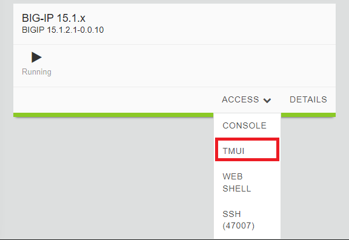

Navigate to **System**. In **Archives** click the **Create** button. In the opened form, type in the archive name and click **Finish**.


You will see the created archive. Proceed by clicking on it.


Start downloading the created UCS archive.

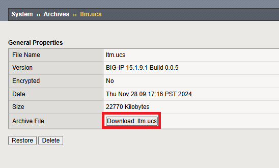

## 2. Migrate the App

Now that we have the UCS archive for our app, we can start the migration process. We will use BIG-IP Next Central Manager to do that.

### 2.1 Upload UCS Archive into Central Manager

Log in BIG-IP Next Central Manager and proceed to the **Application Workspace.**

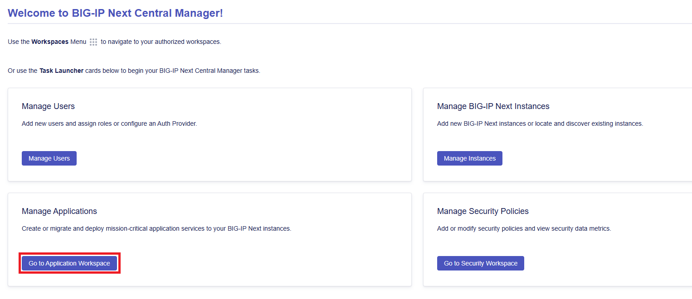

On the application management page, click the **Start Adding App** button and **New Migration** in the opened form.


Give session a name and proceed.

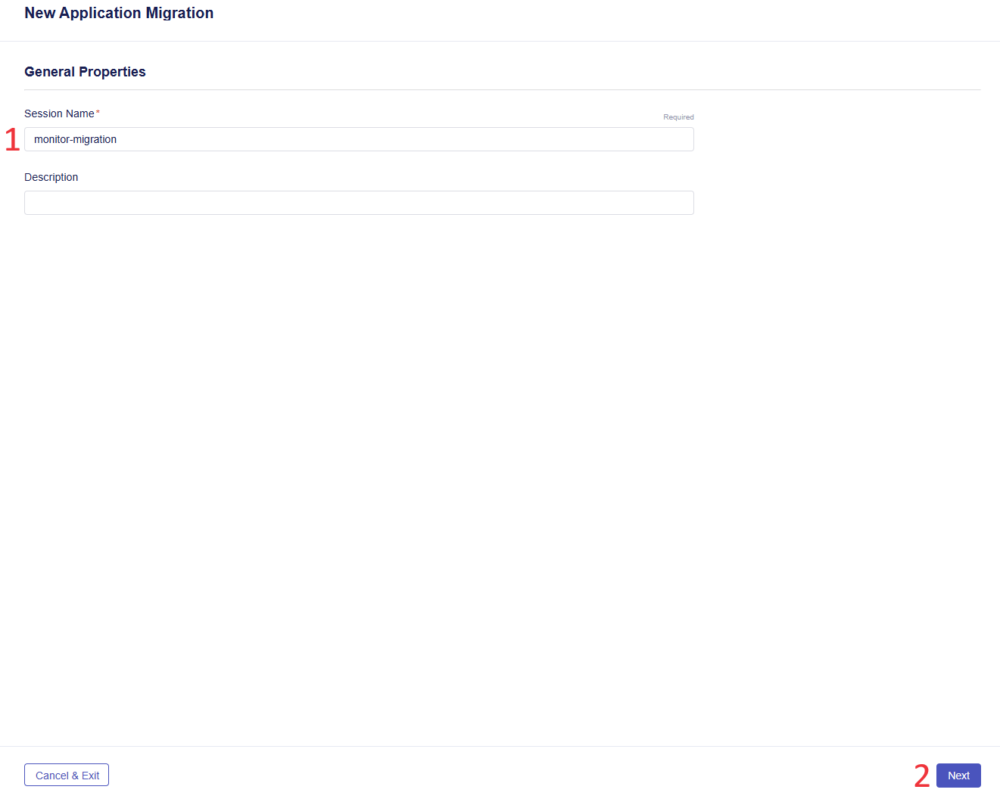

Next, we will drag and drop the UCS archive file downloaded earlier, and enter the BIG-IP TMOS master key. In case of Blueprint usage, the master key is:

```bash
cgGaYTNid4Gvqdelf/85cw==
```

Select grouping application services by IP addresses for this demo flow and click **Next**. Note that file uploading can take some time.

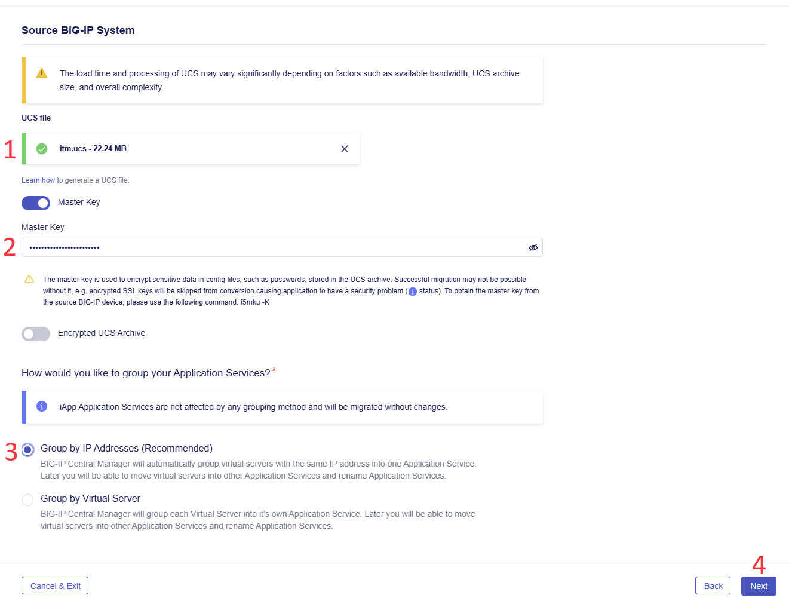

### 2.2 Migrate as Draft

After uploading the UCS archive you will see a list of application services. Select the **ltm-app-custom-monitor-manual** application and click **Migrate as Draft**.

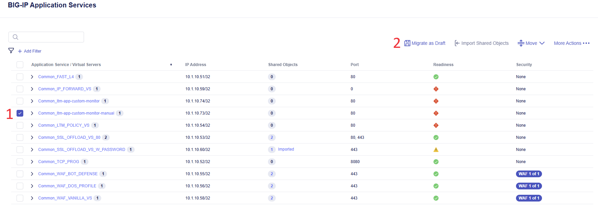

Confirm the migration including the shared objects.

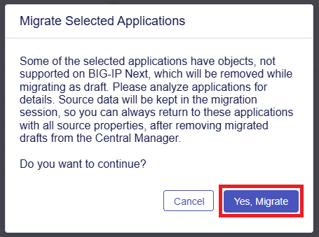

The readiness status of the selected application will change to Migrated. Complete by clicking the **Save & Exit** button.

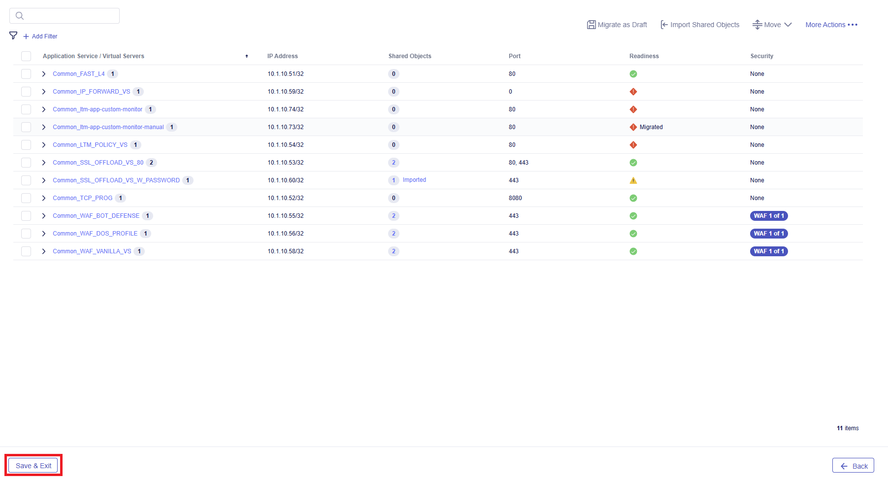

### 2.3 Verify Migrated Monitor

Enter the created application by clicking on it:


In the opened AS3 Declaration you will see the custom monitor with all the parameters migrated:

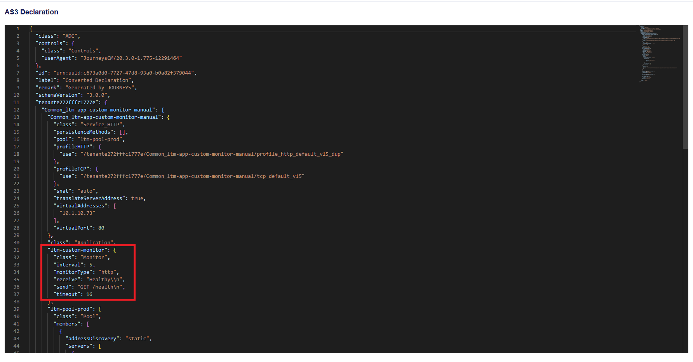

Congrats! You just completed the manual migration of the monitor with its properties.

# Automated Workflow Guide

In this part of the guide, we will automatically migrate the custom monitor.

## 1. Run Migration

Enter the following directory:

```bash
bigip_automation_examples/bigip/bigip_next/ltm/tmos-migrate
```

Run the following command:

```bash
ansible-playbook -i inventory.ini ./playbooks/site.yml
```

Note that this process can take some time.

## 2. Verify Migrated Monitor

After migration is over, log in Central Manager and proceed to **Applications**. You will see the migrated application **ltm-app-custom-monitor**. Enter the app by clicking on it.

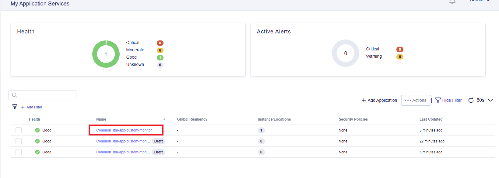

Proceed to its declaration and take a look at the migrated custom monitor properties:

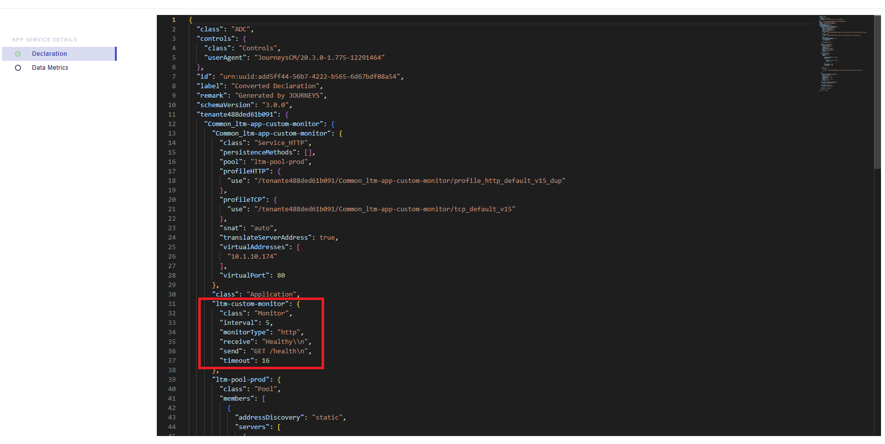

Congrats! You just completed the automated migration of the monitor with its properties.
