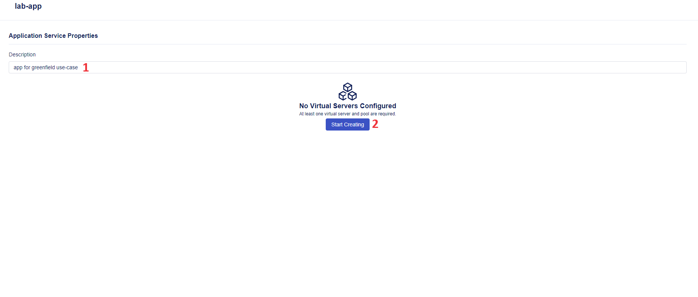
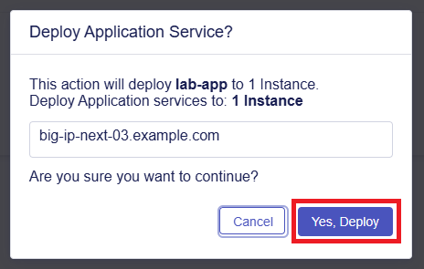

# Deploy and Protect a New App on BIG-IP Next with Security Policy

# Table of Contents

- [Deploy and Protect a New App on BIG-IP Next with Security Policy](#deploy-and-protect-a-new-app-on-big-ip-next-with-security-policy)
- [Table of Contents](#table-of-contents)
- [Overview](#overview)
- [Setup Diagram](#setup-diagram)
- [Environment \& Pre-requisites](#environment--pre-requisites)
- [Blueprint Setup _(for F5 employees or customers with access to UDF)_](#blueprint-setup-for-f5-employees-or-customers-with-access-to-udf)
  - [1. Deploy Blueprint](#1-deploy-blueprint)
  - [2. Copy SSH External](#2-copy-ssh-external)
  - [3. Enter Blueprint](#3-enter-blueprint)
  - [4. Clone Repository](#4-clone-repository)
  - [5. Data Initialization for Docker](#5-data-initialization-for-docker)
  - [6. Build Docker](#6-build-docker)
  - [7. Install Dependencies](#7-install-dependencies)
  - [8. Infrastructure Configuration](#8-infrastructure-configuration)
  - [9. Validate NGINX App and TMOS](#9-validate-nginx-app-and-tmos)
- [Docker Setup (_optional_)](#docker-setup-optional)
  - [1. Clone repository](#1-clone-repository)
  - [2. Build Docker](#2-build-docker)
  - [3. Enter Docker](#3-enter-docker)
- [Manual Workflow Guide](#manual-workflow-guide)
  - [1. Start Creating an App](#1-start-creating-an-app)
  - [2. Add Pool and Server](#2-add-pool-and-server)
  - [3. Create WAF Security Policy](#3-create-waf-security-policy)
  - [4. Add Pool Member](#4-add-pool-member)
  - [5. Deploy App](#5-deploy-app)
  - [6. Validate App](#6-validate-app)
- [Automated Workflow Guide](#automated-workflow-guide)
  - [1. Prerequisites](#1-prerequisites)
  - [2. Add access creds for BIG-IP Next](#2-add-access-creds-for-big-ip-next)
  - [3. Initialize terraform](#3-initialize-terraform)
  - [4. Preview app and security policy config (_optional_)](#4-preview-app-and-security-policy-config-optional)
  - [5. Deploy app and security policy](#5-deploy-app-and-security-policy)
  - [6. Verify the deployed app with its policy](#6-verify-the-deployed-app-with-its-policy)

# Overview

This guide provides manual walk-through steps and automated Terraform scripts for a "greenfield deployment" of an app to BIG-IP Next. Using BIG-IP Next Central Manager (CM) we will also protect this application with a WAF Policy in blocking mode. You may leverage the provided sample application by using the included Docker.

# Setup Diagram


There are two workflows to deploy an app to BIG-IP Next with Next WAF Policy covered by this guide: [manual](#manual-workflow-guide) or [automated](#automated-workflow-guide). The Terraform scripts automate the same steps as in the manual flow.

# Environment & Pre-requisites

You may use your own environment with BIG-IP NEXT, in which, as a pre-requisite, you need to have at a minimum:

- BIG-IP NEXT Instance(s), where we will deploy the new app config

- BIG-IP NEXT Central Manager, which we will use for configuring the app and WAF Policy

For executing automation scripts, you need to utilize a Linux machine with network access to the BIG-IP NEXT CM.
On this Linux machine you may choose to run Docker in order to take advantage of the sample app(s) and tooling (Terraform, etc.)

# Blueprint Setup _(for F5 employees or customers with access to UDF)_

**If you are an F5 employee or customer with access to UDF, you can use the following BIG-IP NEXT blueprint flow as the foundation for your environment: "NEXT WAF- Automation". Search for this name and utilize the latest version of the blueprint. This GitHub repo is already optimized to work with this UDF blueprint.**

### 1. Deploy Blueprint

Navigate to the **Blueprints** and search for **NEXT WAF- Automation**. Deploy it.


### 2. Copy SSH External

After the Blueprint has been deployed, navigate to the **Deployments** section and proceed to the **Details** of your deployment. Select the **Components** tab to see three components we are going to use: **Ubuntu Jump Host (client/server)**, **BIG-IP 15.1.x**, **BIG-IP Next Central Manager**. Proceed to the **Ubuntu Jump Host**.


Go to the **Access Methods** tab and copy the SSH external.

### 3. Enter Blueprint

Next, enter Blueprint using your SSH key via command line interface. You can use [this guide](https://help.udf.f5.com/en/articles/3347769-accessing-a-component-via-ssh) on accessing the object via SSH.

### 4. Clone Repository

After that, clone the [repository](https://github.com/f5devcentral/bigip_automation_examples.git). Note that you don't need to specify keys in Blueprint since they are already specified.

### 5. Data Initialization for Docker

Go to the `bigip/bigip_next/security/migrate-from-tmos/docker-env/` directory of the cloned repository. Run the `init.sh` to create a local key folder:

```bash
sh ./init.sh
```

You can verify that the folder with the keys has been created.

### 6. Build Docker

Next, we will build Docker. Note that executing this command can take some time.

```bash
sh ./build.sh
```

As soon as the build is completed, enter Docker:

```bash
sh ./run.sh
```

### 7. Install Dependencies

Run the command to install the collections and libraries required in Ansible playbook:

```bash
sh ./install-prerequisites.sh
```

### 8. Infrastructure Configuration

Enter `bigip/bigip_next/security/migrate-from-tmos/init` to initialize BIG-IP to resolve the app. Note that the app will be resolved in **10.1.10.90** and **10.1.10.91** IPs which are virtual addresses of routing via TMOS. The app itself will be in **10.1.20.102** IP. Run the following command to start initializing:

```bash
ansible-playbook -i inventory.ini site.yaml
```

### 9. Validate NGINX App and TMOS

Let's verify the app is up and running:

```bash
curl http://10.1.20.102/server1
```

```bash
curl http://10.1.20.102/server2
```

Verify TMOS routing by running the following commands:

```bash
curl http://10.1.10.90/server1
```

```bash
curl http://10.1.10.91/server1
```

Congrats! We have just completed configuration of infrastructure using Blueprint that will be used for further [manual](#manual-workflow-guide) or [automated](#automated-workflow-guide) flow steps of this guide.

# Docker Setup (_optional_)

## 1. Clone repository

Clone and install the repository: https://github.com/f5devcentral/bigip_automation_examples.git

## 2. Build Docker

Enter the folder `bigip/bigip_next/security/migrate-from-tmos/docker-env` and run the following command to build Docker that will include Terraform, Ansible, and nano. Note that executing this command can take some time.

```bash
sh ./build.sh
```

## 3. Enter Docker

Enter the docker by running the command:

```bash
sh ./run.sh
```

# Manual Workflow Guide

## 1. Start Creating an App

Log in BIG-IP Next Central Manager and proceed to **Application Workspace**.


Click the **Start Adding Apps** button. This will open the creation form.


Before moving on to app configuration, give it a name, select the type of application service, and click the **Start Creating** button.


You can type in a description for the application service and move on.



## 2. Add Pool and Server

Next, we will add a pool and virtual server. Navigate to the **Pools** tab and click the **Create** tab.


Give the pool a name, make sure to use Service Port **80** and Load-Balancing Mode **round-robin** for this flow. Move on to the **Virtual Servers** tab to configure one for the app.


Give the virtual server a name, select the pool we've just added in the drop-down menu and make sure to have Virtual Port **80** specified. As soon as the virtual server has been configured, proceed to adding a WAF Security Policy.


## 3. Create WAF Security Policy

First, we need to enable the WAF Policy using the toggle. Next, click the **Create** button which will open the WAF Policy configuration form.


Give WAF policy a name and enable the L7 DoS Protection for the app. Take a look at other configuration, such as enabled Bot Defense and Threat Intelligence options. Also make sure to have **Blocking** selected for Enforcement Mode. As you can see, BIG-IP Next Central Manager provides an opportunity to set up the blocking enforcement mode right at the WAF Policy configuration stage, which ensures application security for our app from day one. When the policy properties have been configured, proceed by clicking **Save**.


The name should appear in WAF Policy name field. Click **Save** to move on.


Back on the app configuration page, take a look at the configured properties and click **Review and Deploy**.


After that, we will specify the deployment instance. CLick the **Start Adding** button, choose an instance and add it to the list.


## 4. Add Pool Member

First, specify **10.1.10.94** virtual address. Then, in order to specify the deployment instance, we will add a pool member. Open the drop-down menu under **Members** and select adding a pool member.


In the opened configuration window add a row and fill it in by giving the pool member a name and specifying the **10.1.10.102** IP Address.


## 5. Deploy App

Back on the deployment instance page, the configured pool member will appear in the table. Click the **Validate All** button. This will start the process of validating all the configurations before deployment.


As soon as validation is over, its result will be displayed on the page. If the validation is successful, you can click the **Deploy Changes** button.


The next window will ask you to confirm application service deployment. Take a look at the app name and deployment instance and click **Yes, Deploy**.



As soon as the deployment process is over, you will see a notification in the lower right corner and the application will be displayed in the table. You can see its health status, instance and security policy we configured.


## 6. Validate App

You can validate the app by running the following commands:

```bash
curl http://10.1.10.94/server1
```

```bash
curl http://10.1.10.94/server2
```

```bash
curl http://10.1.10.94/server10
```

Congrats, you did it! You deployed a new app to BIG-IP Next and applied a WAF policy to it using BIG-IP Next Central Manager. Central Manager lets us configure the WAF Policy in an easy and straightforward way making blocking mode available right away.

# Automated Workflow Guide

## 1. Prerequisites

- Clone and install the repository https://github.com/f5devcentral/bigip_automation_examples.git if you haven't done so yet
- Access to BIG-IP Central Manager
- CLI tool to run commands
- Setup Docker (_optional but recommended_)

## 2. Add access creds for BIG-IP Next

First, you need to enter the `input.tfvars` file and specify your own variables:

- Central Manager address (`cm`),
- username and password to access Central Manager,
- BIG-IP Next address (`target`).

Then you go to the `app-as3.json` file which is an AS3 definition of the app to be deployed and contains all app info for the deployment. Update app info as needed. Note that `virtualAddresses` is where the app will be deployed, and `serverAddresses` is the routing address of the app.

Lastly, you can update security policy info, if needed, in the `policy.json` file containing the security policy to be deployed for the app. Note that the policy specified in the file will be deployed in blocking mode.

## 3. Initialize terraform

In the CLI run the following command to initialize terraform:

```bash
terraform init
```

## 4. Preview app and security policy config (_optional_)

Run the following command to preview the changes that Terraform will execute: the app to be created and the security policy with its configuration.

```bash
terraform plan -var-file=input.tfvars
```

## 5. Deploy app and security policy

Run the following command to create and deploy the app and security policy:

```bash
terraform apply -var-file=input.tfvars
```

## 6. Verify the deployed app with its policy

First, let's verify the app by running the following commands:

```bash
curl http://10.1.10.93/server1
```

```bash
curl http://10.1.10.93/server2
```

```bash
curl http://10.1.10.93/server3
```

Next, log into your Central Manager and navigate to the **Application Workspace**.


You will see a newly deployed app with its details: health status, locations/instances and security policies.


Next, we will take a look at the created security policy. Navigate to the **Security** tab and proceed to **Policies** under the **WAF** section.


Finally, we can drill down into the created policy details. Click on the policy to proceed.


<!-- # Additional Related Resources

=======TODO======== -->
