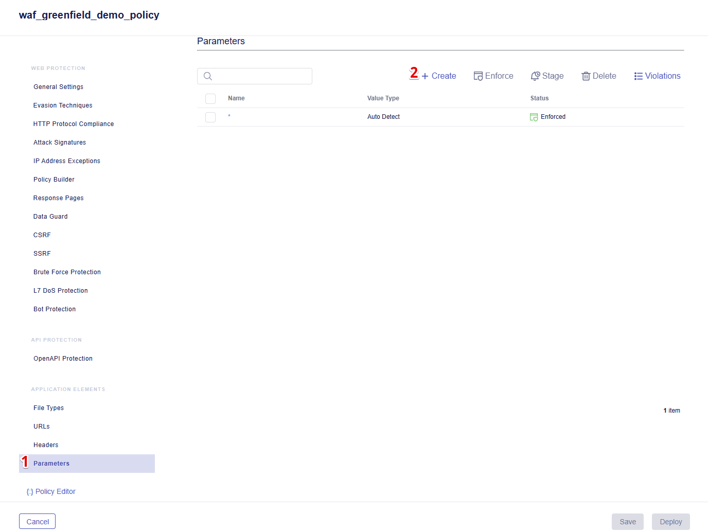
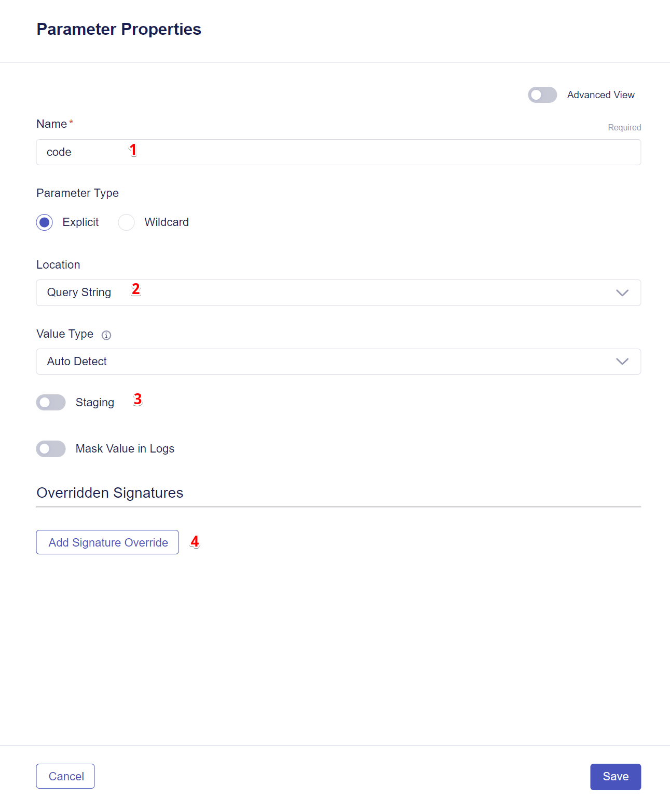
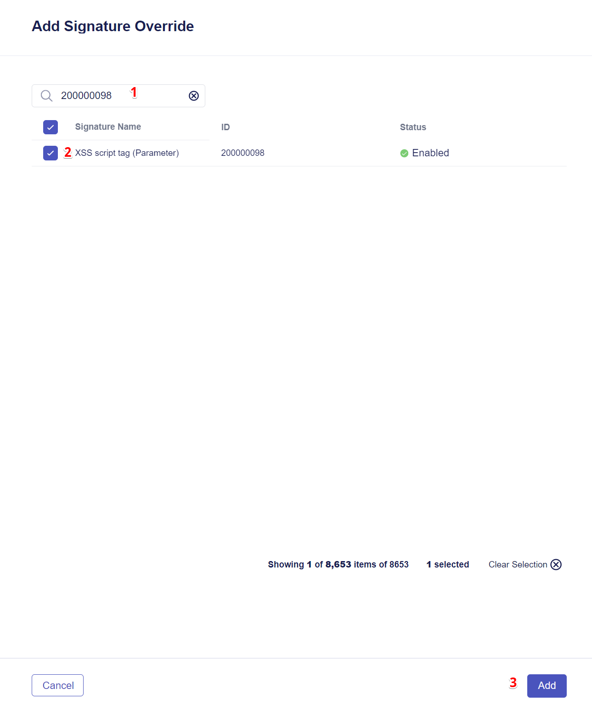
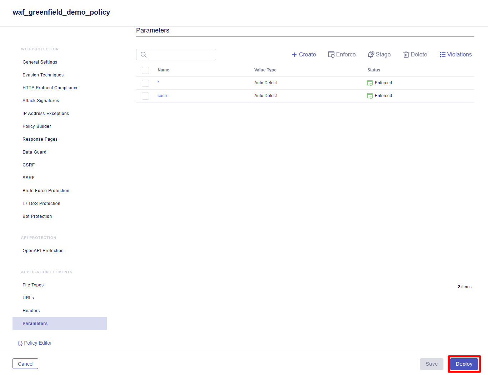

# Disable Signature on Specific URL

# Table of Contents

- [Disable Signature on Specific URL](#disable-signature-on-specific-url)
- [Table of Contents](#table-of-contents)
- [Overview](#overview)
- [Environment](#environment)
- [Manual Workflow Guide](#manual-workflow-guide)
  - [Copy Signature Names](#copy-signature-names)
  - [Add Parameter to Policy](#add-parameter-to-policy)
  - [Add Signature Overrides](#add-signature-overrides)
  - [Verify Updates](#verify-updates)
- [Automated Workflow Guide](#automated-workflow-guide)

# Overview

This flow is one of three use-cases of the [Operations](https://github.com/f5devcentral/bigip_automation_examples/tree/main/bigip/bigip_next/security/operations/Readme.md) series focused on disabling signatures on specific urls. In the course of this guide we will add signature rule for the url `code` parameter to security policy. For this guide we will use the preinstalled app with a WAF policy.

# Environment

If you haven't done the [Deploy and Protect a New App on BIG-IP Next with Security Policy](https://github.com/f5devcentral/bigip_automation_examples/blob/main/bigip/bigip_next/security/deploy-with-new-next-waf/Readme.md#environment--pre-requisites) guide yet, you will need to configure the environment first. Follow the steps:

- [Blueprint Setup (for F5 employees or customers with access to UDF)](https://github.com/f5devcentral/bigip_automation_examples/blob/main/bigip/bigip_next/security/deploy-with-new-next-waf/Readme.md#blueprint-setup-for-f5-employees-or-customers-with-access-to-udf)
- [Docker Setup](https://github.com/f5devcentral/bigip_automation_examples/blob/main/bigip/bigip_next/security/deploy-with-new-next-waf/Readme.md#docker-setup)
- [Infrastructure Configuration - 1 & 2](https://github.com/f5devcentral/bigip_automation_examples/blob/main/bigip/bigip_next/security/deploy-with-new-next-waf/Readme.md#infrastructure-configuration)
- Infrastructure Configuration: 3. Verify policy:

  - run the following curl command to see script list:

    ```bash
    curl 'http://10.1.10.93/api/v1/script'
    ```

    The pre-setup WAF will return an error:

    ```bash
    curl -X PUT "http://10.1.10.93/api/v1/script/1?code=<script>showPopup()</script>"
    ```

    This will output the false positive result because we have a setup WAF whose signature is executed when we send the code parameter for the script and makes it impossible to execute the command. So we will need to disable the signature that executes as false positive for this API and code parameter in URL.

    The application executes API whose Swagger can be viewed by running the following command:

    ```bash
    cat ~/bigip_automation_examples/bigip/bigip_next/security/migrate-from-tmos/init/templates/code-crud-swagger.yaml
    ```

# Manual Workflow Guide

## Copy Signature Names

Log in BIG-IP Next Central Manager via the GUI of the deployment we did earlier or via your own one, and proceed to **Security Workspace**.


In the **Policies** section of the opened dashboard select **Filter by Policy Name**.


This will filter the information by our policy name. Scroll down to see the list of signatures executed with false positive result. Note down the number names of the signatures.


## Add Parameter to Policy

Next navigate to the **Policies** tab and enter the policy enabled for our app.


Move on to **Parameters** to add the `code` parameter for which we want to disable the signatures.



Type in `code` as parameter name, select the **Query String** location and disable the staging mode. Proceed to adding signature overrides.



## Add Signature Overrides

Into the search field paste number name of signature we copied earlier. After the signature with such name is found, check it off and click the **Add** button.



Confirm disabling the selected signature.


Add the second signature override by repeating the same steps. Make sure to type in number number of the second copied signature.


Click **Save** as soon as the second signature override is added.


Finally, deploy the edited policy:



Add a comment if needed and confirm the deployment.


## Verify Updates

Rerun the following command to see if the script has been updated:

```bash
curl -X PUT "http://10.1.10.93/api/v1/script/1?code=<script>showPopup()</script>"
```

# Automated Workflow Guide

TBD
