# Disable Signature on Specific URL

# Table of Contents

- [Disable Signature on Specific URL](#disable-signature-on-specific-url)
- [Table of Contents](#table-of-contents)
- [Overview](#overview)
- [Environment](#environment)
- [Manual Workflow Guide](#manual-workflow-guide)
  - [1. Copy Signature Names](#1-copy-signature-names)
  - [2. Add Parameter to Policy](#2-add-parameter-to-policy)
  - [3. Add Signature Overrides](#3-add-signature-overrides)
  - [4. Verify Updates](#4-verify-updates)
- [Automated Workflow Guide](#automated-workflow-guide)
  - [1. Configure Connectivity to Central Manager](#1-configure-connectivity-to-central-manager)
  - [2. Configure Update Logging](#2-configure-update-logging)
    - [2.1 Connect to Running Docker](#21-connect-to-running-docker)
    - [2.2 Review Logs in Real-Time](#22-review-logs-in-real-time)
  - [3. Deploy Updates](#3-deploy-updates)
  - [4. Reports](#4-reports)
    - [4.1 Signature Override Report](#41-signature-override-report)
    - [4.2 Realtime Signature Override Logs](#42-realtime-signature-override-logs)
  - [5. Verify Deployed Updates](#5-verify-deployed-updates)

# Overview

This flow is one of three use-cases of the [Operations](https://github.com/f5devcentral/bigip_automation_examples/tree/main/bigip/bigip_next/security/operations/Readme.md) series focused on disabling signatures on specific URLs. In the course of this guide we will both update parameters with signature overrides and create new parameters with their own overrides. For this guide we will use the app with a WAF policy setup and deployed in the [Deploy and Protect a New App on BIG-IP Next with Security Policy](https://github.com/f5devcentral/bigip_automation_examples/blob/main/bigip/bigip_next/security/deploy-with-new-next-waf/Readme.md#environment--pre-requisites) guide. We will assume that our app stores scripts to be embedded in webpages. We have app's server that allows app to execute CRUD operations and has its APIs specified in the Swagger file.

# Environment

If you are an F5 employee or customer with access to UDF and you haven't done the [Deploy and Protect a New App on BIG-IP Next with Security Policy](https://github.com/f5devcentral/bigip_automation_examples/blob/main/bigip/bigip_next/security/deploy-with-new-next-waf/Readme.md#environment--pre-requisites) guide yet, first you will need to complete it in order to setup the environment infrastructure and deploy the required app with WAF. Follow the steps below:

- [Blueprint Setup (for F5 employees or customers with access to UDF)](https://github.com/f5devcentral/bigip_automation_examples/blob/main/bigip/bigip_next/security/deploy-with-new-next-waf/Readme.md#blueprint-setup-for-f5-employees-or-customers-with-access-to-udf)
- [Docker Setup](https://github.com/f5devcentral/bigip_automation_examples/blob/main/bigip/bigip_next/security/deploy-with-new-next-waf/Readme.md#docker-setup)
- [Infrastructure Configuration - items 1 & 2](https://github.com/f5devcentral/bigip_automation_examples/blob/main/bigip/bigip_next/security/deploy-with-new-next-waf/Readme.md#infrastructure-configuration)
- [Automated Workflow Guide - items 1 - 5](https://github.com/f5devcentral/bigip_automation_examples/blob/main/bigip/bigip_next/security/deploy-with-new-next-waf/Readme.md#automated-workflow-guide) to deploy the app with the WAF policy
- Verify the Deployed App with its Policy:

  - (optional) If you want to view app's APIs, enter the Swagger file of app API by running the following command:

    ```bash
    cat ~/bigip_automation_examples/bigip/bigip_next/env-init/environment/templates/code-crud-swagger.yaml
    ```

  - Run the following command to see the list of scripts:

    ```bash
    curl 'http://10.1.10.93/api/v1/script'
    ```

  - Run the following command to update a script:

    ```bash
    curl -X PUT "http://10.1.10.93/api/v1/script/1?code=<script>showPopup()</script>"
    ```

    This will output the false positive result because we have a setup WAF whose signature is executed when we send the code parameter for the script and makes it impossible to execute the command. So we will need to disable the signature that executes as false positive for this API and code parameter in URL.

# Manual Workflow Guide

## 1. Copy Signature Names

After having setup the [environment](#environment) log in BIG-IP Next Central Manager via the GUI of the deployment we did earlier or via your own one, and proceed to **Security Workspace**.


In the **Policies** section of the opened dashboard select **Filter by Policy Name**.

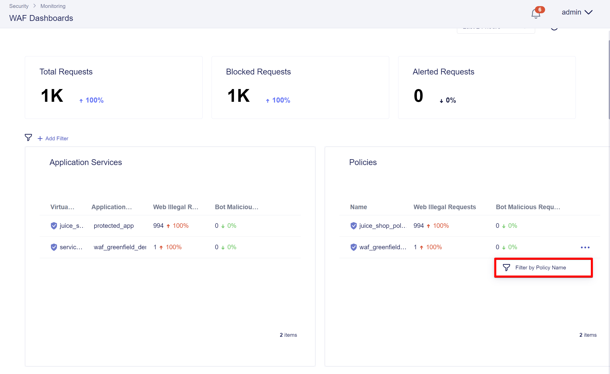

This will filter the information by our policy name. Scroll down to see the list of signatures executed with false positive result during the verification we did earlier. Note down the number names of the signatures.

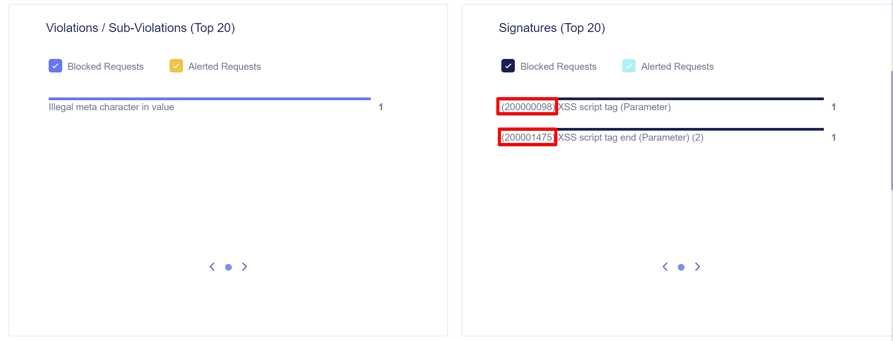

## 2. Add Parameter to Policy

Next, navigate to the **Policies** tab and enter the policy enabled for our app.


Move on to **Parameters** to add the `code` parameter for which we want to disable the signatures.


Type in `code` as parameter name, select the **Query String** location and disable the staging mode. Proceed to adding signature overrides.


## 3. Add Signature Overrides

Paste number name of signature we copied earlier into the search field. After the signature with such name is found, check it off and click the **Add** button.


Confirm disabling the selected signature.

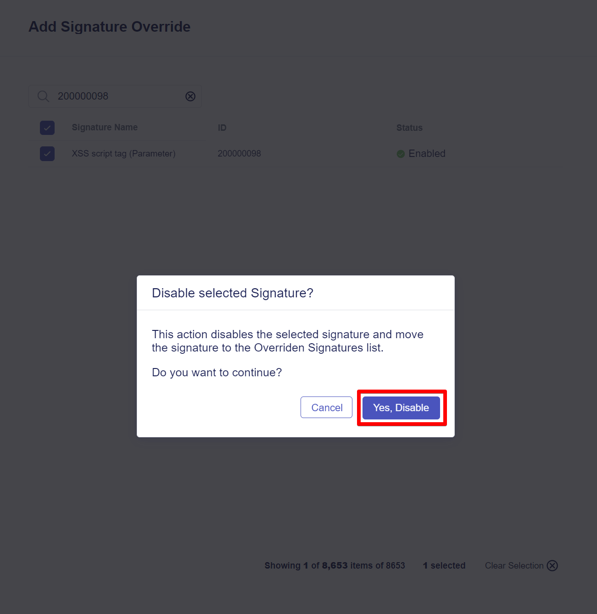

Add the second signature override by repeating the same steps.

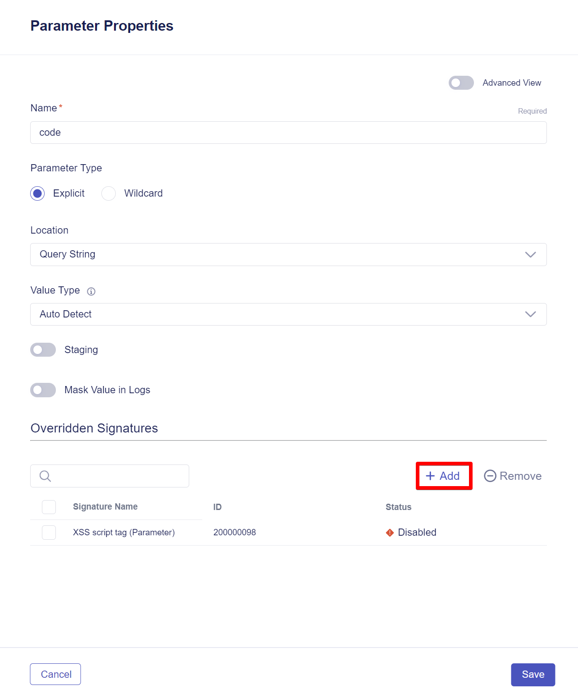

Make sure to type in number name of the second copied signature.

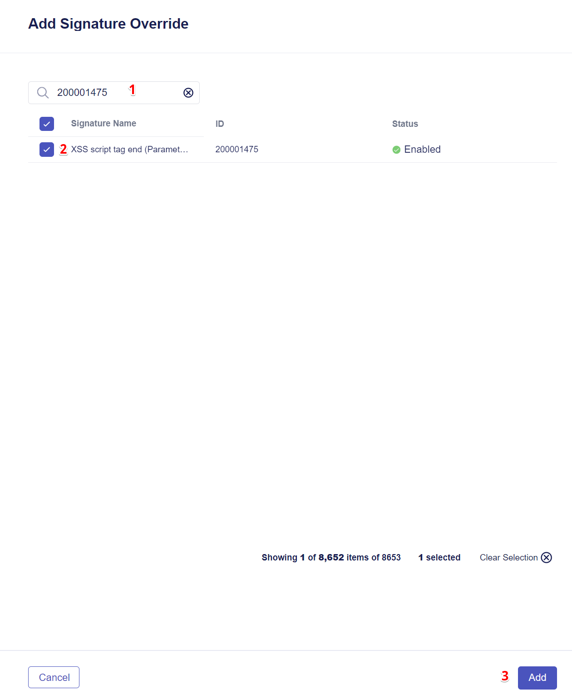

Click **Save** as soon as the second signature override is added.

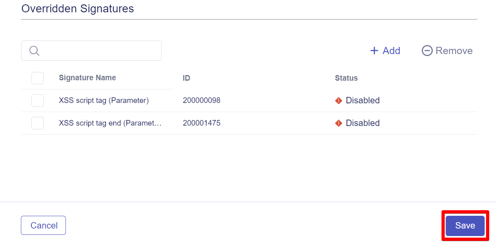

Finally, deploy the edited policy:


Add a comment if needed and confirm the deployment.

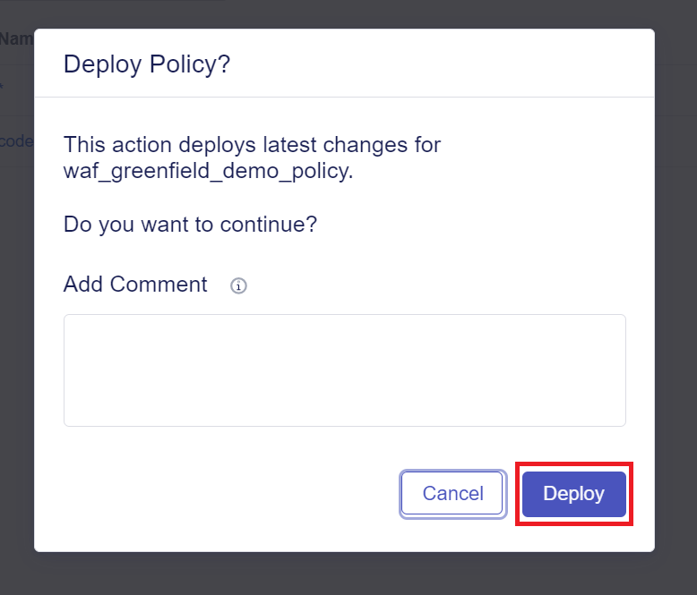

## 4. Verify Updates

Rerun the following command to see if the script has been updated:

```bash
curl -X PUT "http://10.1.10.93/api/v1/script/1?code=<script>showPopup()</script>"
```

If the script is updated, you will see the following output:

```bash
"message": "Script updated successfully."
```

# Automated Workflow Guide

If you are following the Blueprint flow, you will use the app deployed in the [Deploy and Protect a New App on BIG-IP Next with Security Policy](https://github.com/f5devcentral/bigip_automation_examples/blob/main/bigip/bigip_next/security/deploy-with-new-next-waf/Readme.md#environment--pre-requisites) guide, therefore you will need to follow the steps described in the [Environment](#environment) section if you have not done so yet in order to set up the environment and deploy app with WAF policy. You can skip the [Environment](#environment) section if you have already deployed the app with WAF.

## 1. Configure Connectivity to Central Manager

**If you are using the Blueprint, you can skip this step since all the configuration is done there.**

Proceed to the following file:

```bash
bigip/bigip_next/security/operations/disable-signature-url/next_vars.yml
```

First, specify Central Manager parameters: `address`, `user`, `password`. Second, specify information for signature overrides including WAF name, list of parameters and signatures to be overridden. And finally, indicate file to save override reports to and task timeout time in minutes. Note that if you have three and more BIG IP Next nodes for updates, you might need 15 and more minutes:

```yml
central_manager:
  address: 10.1.1.5
  user: admin
  password: Welcome123!

override_signature:
  - name: waf_greenfield_demo_policy
    parameters:
      - name: code
        signatures:
          - 200001088
      - name: query
        signatures:
          - 200000098
          - 200001088
          - 200001475
          - 200101609

task_timeout_minutes: 15
override_report: ../signature-override-report.txt
```

## 2. Configure Update Logging

### 2.1 Connect to Running Docker

If the docker option is used, there is a possibility to see the logs of parameter update with signature overrides process. First, you need to establish one more SSH connection to jumphost. Second, connect to the running docker. To do that navigate to:

```bash
bigip/bigip_next/env-init/docker
```

In this folder run the following command to connect to the running Docker:

```bash
sh ./connect.sh
```

### 2.2 Review Logs in Real-Time

Proceed to the following folder:

```bash
bigip/bigip_next/security/operations/disable-signature-url
```

Run the following command to review logs:

```bash
tail -f ./logs/cm_polling.log
```

## 3. Deploy Updates

Navigate to the following directory in your first CLI:

```bash
bigip/bigip_next/security/operations/disable-signature-url
```

Run the following command to deploy updated parameter with signature override and create a new parameter with its own overrides. Note that deploy can take some time.

```bash
ansible-playbook ./playbooks/site.yml
```

You will see the process status in the second CLI set up for logging.

## 4. Reports

### 4.1 Signature Override Report

Run the following command to view update logs:

```bash
cat signature-override-report.txt
```

You will see the following report as output showing policy name, time of deploy task creation & completion, and parameters there were added:

```
|-----------------------------------------------|----------------------------------|----------------------------------|-----------------------------------------------|--------------|--------------------------------------------|
| Policy Name                                   | Deploy Task Created              | Deploy Task Completed            | Paremeter                                     | Status       | Message                                    |
|-----------------------------------------------|----------------------------------|----------------------------------|-----------------------------------------------|--------------|--------------------------------------------|
| waf_greenfield_demo_policy                    | 2024-09-24T15:57:58.236981Z      | 2024-09-24T15:58:11.898553Z      |                                               | Successed    | Task completed                             |
|                                               |                                  |                                  | code: Append                                  |              |                                            |
|                                               |                                  |                                  | query: Append                                 |              |                                            |
|-----------------------------------------------|----------------------------------|----------------------------------|-----------------------------------------------|--------------|--------------------------------------------|
```

### 4.2 Realtime Signature Override Logs

You will see the following logs in the second connected CLI:

```
Task Polling: c36e53b1-c023-424d-89a6-c537033443b2 - Redeploy Policy > running
Task Polling: c36e53b1-c023-424d-89a6-c537033443b2 - Redeploy Policy > running
Task Polling: c36e53b1-c023-424d-89a6-c537033443b2 - Redeploy Policy > running
Task Polling: c36e53b1-c023-424d-89a6-c537033443b2 - Redeploy Policy > completed
```

## 5. Verify Deployed Updates

Log in BIG-IP Next Central Manager via the GUI of the deployment we did earlier or via your own one, and proceed to **Security Workspace**. Proceed to **WAF** = > **Policies**. Enter the deployed policy by clicking on it.

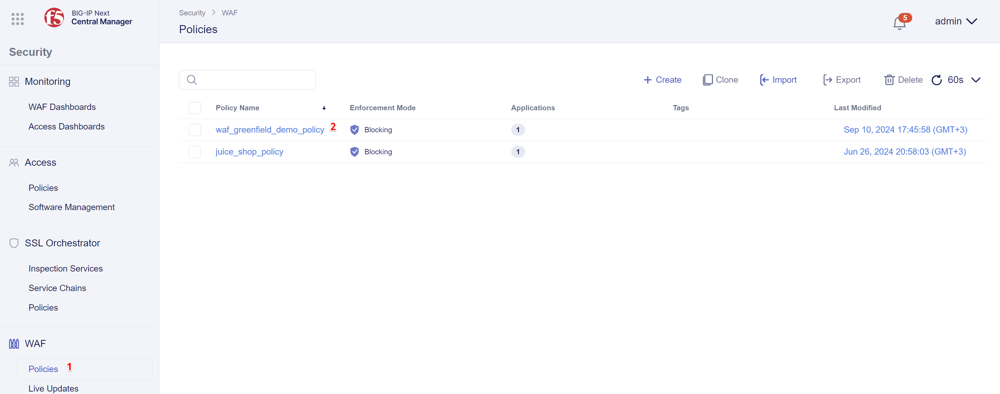

Navigate to the **Parameters** tab. You will see the `code` parameter created in the [Manual Workflow Guide](#manual-workflow-guide) and updated in the [previous step](#3-deploy-updates), as well `query` parameter just created. Enter the `code` parameter.

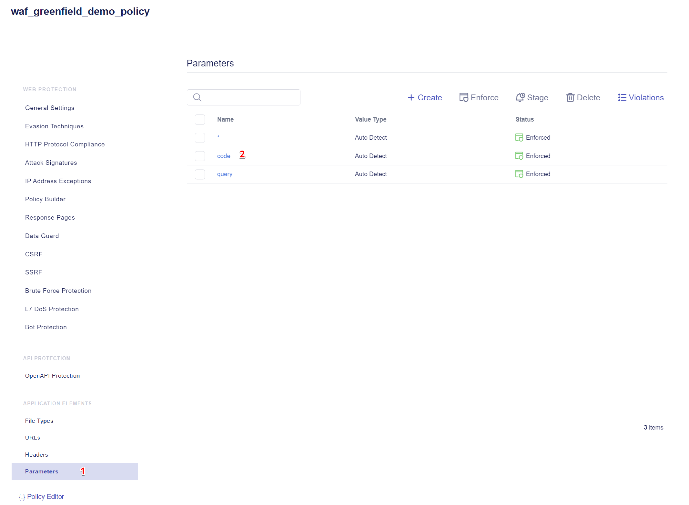

You will see the newly added signature. Note that the two signatures created earlier were not modified.

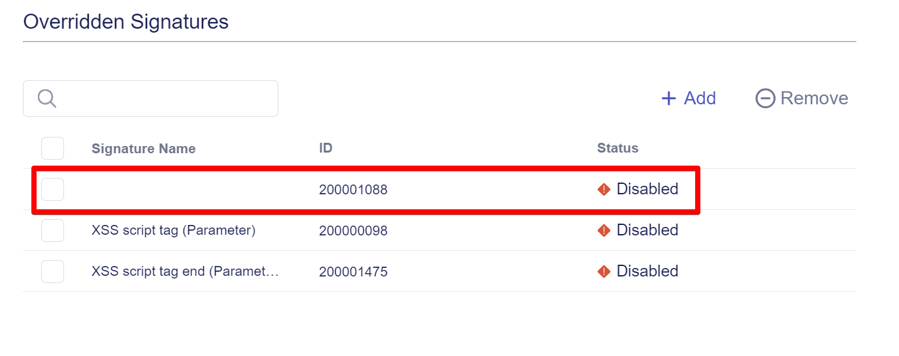

Go back to the **Parameters** page and enter the newly added parameter `query`.

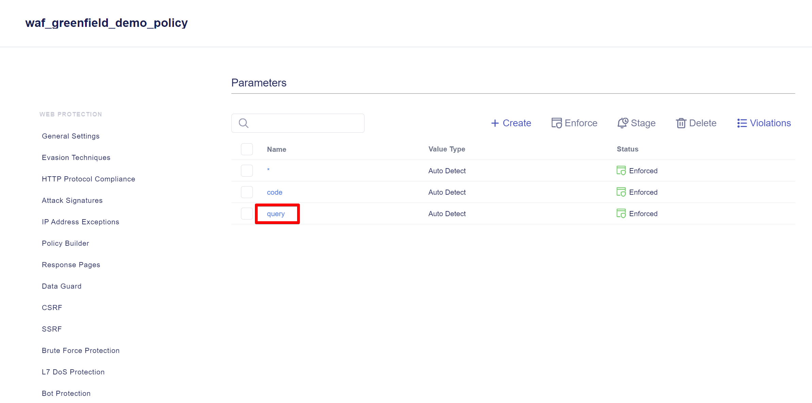

You will see four newly created signatured in the new parameter. Note that parameters added earlier within the [Manual Workflow Guide](#manual-workflow-guide) haven't been changed. We just added a new signature to the existing parameter, and added a new parameter with its own signatures.

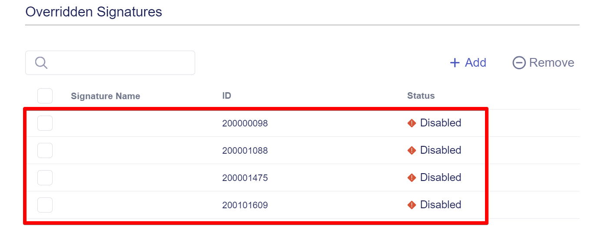
