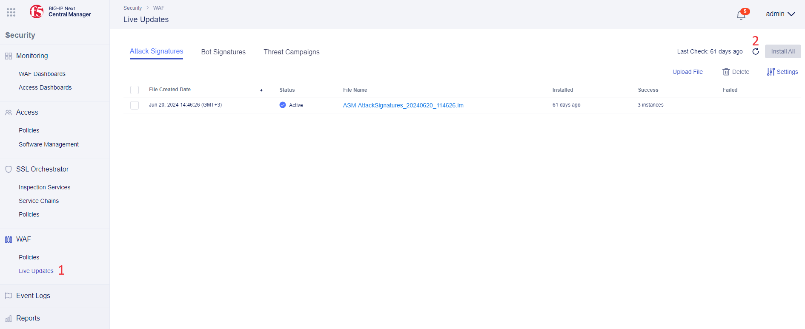
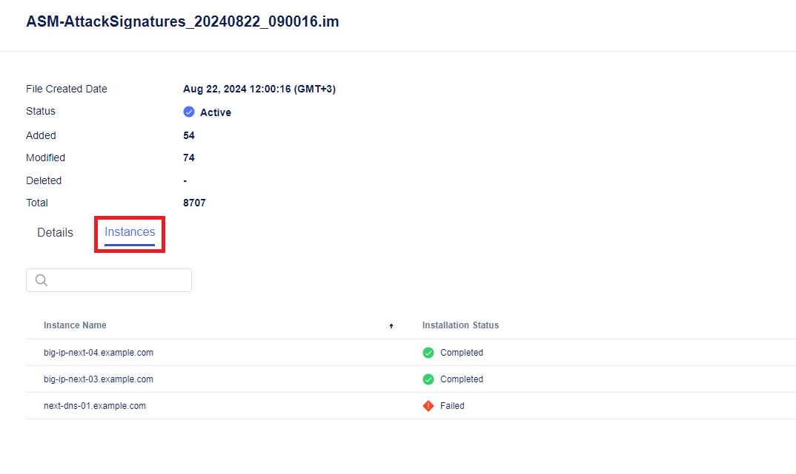

# Update Signature Package for Next WAF in Central Manager and Push to All Instances

# Table of Contents

- [Update Signature Package for Next WAF in Central Manager and Push to All Instances](#update-signature-package-for-next-waf-in-central-manager-and-push-to-all-instances)
- [Table of Contents](#table-of-contents)
- [Overview](#overview)
- [Docker Setup](#docker-setup)
- [Manual Workflow Guide](#manual-workflow-guide)
- [Automated Workflow Guide](#automated-workflow-guide)
  - [1. Configure Connectivity](#1-configure-connectivity)
  - [2. Checking for Updates and Installing Them](#2-checking-for-updates-and-installing-them)

# Overview

This flow is one of three use-cases of the [Operations](https://github.com/f5devcentral/bigip_automation_examples/tree/main/bigip/bigip_next/security/operations/Readme.md) series on applying updates to Next WAF. It provides manual walk-through steps and automated Terraform scripts for updating signature package for Next WAF in Central Manager and then pushing them to all the instances.

# Docker Setup

You may choose to use the included Docker. You may run it on Linux machine in order to take advantage of Ansible tooling.

If you chose to use Docker, follow the steps to set it up in this [guide](https://github.com/f5devcentral/bigip_automation_examples/tree/main/bigip/bigip_next/security/deploy-with-new-next-waf#docker-setup).

# Manual Workflow Guide

Log in BIG-IP Next Central Manager via the GUI of the deployment we did earlier or via your own one, and proceed to **Security Workspace**.


Go to the **Live Updates** section. You will see the **Attack Signatures** tab. Click the button to manually download latest updates for **Attack Signatures** to Central Manager. You can repeat this step for **Bot Signatures** and **Threat Campaigns** accordingly.



Download and installation of Attack Signatures updates to Central Manager will start. Note that this process can take some time.

After the installation to the Central Manager has been completed, the file will appear on the list. Select the file and click **Install All** to upload the update file to the instances. This will open a window with the detailed information.


CLick on the **Instances** tab to see the instances update file will be installed to. Proceed by clicking **Install All**.


Confirm the installation.


CLick the installed file to drill down into the details.


Navigate to the **Instances** tab and take a look at the installation status.



# Automated Workflow Guide

In this part of the guide we will automatically check for Next WAF updates of **Attack Signatures**, **Bot Signatures** and **Threat Campaigns**, and then install them to the instances after that.

Before proceeding, you need to enter Docker if you chose [Docker setup](#1-docker-setup-optional) option or the environment in Jump Host.

## 1. Configure Connectivity

In the `bigip/bigip_next/security/operations/live-update/next_vars.yml` file specify the following parameters for Central Manager to establish connectivity:

- `address`
- `user`
- `password`

## 2. Checking for Updates and Installing Them

Start checking for updates of Attack Signatures, Bot Signatures and Threat Campaigns and pushing them all to the instances by running the following command:

```bash
ansible-playbook playbooks/site.yml
```

Note that this process can take some time.

There are two files in `bigip/bigip_next/security/operations/live-update/playbooks` that can be run separately if needed:

- `bigip/bigip_next/security/operations/live-update/playbooks/check_live_update.yml` to check if there are updates available

- `bigip/bigip_next/security/operations/live-update/playbooks/push_updates.yml` to push the updates
